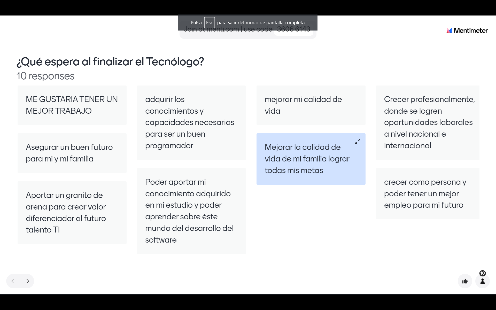
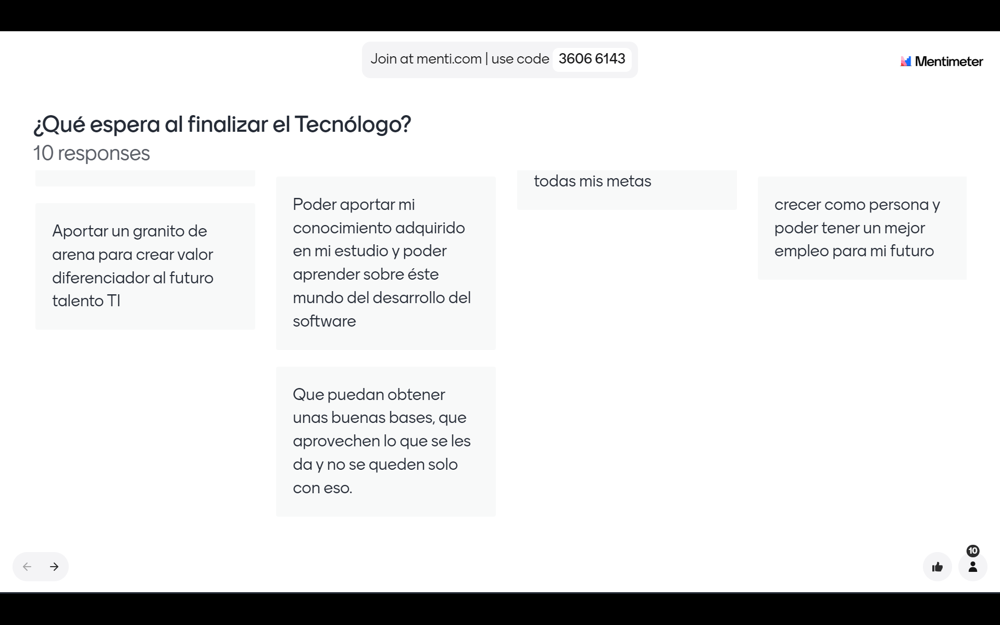

# Compromisos de la ficha 2758360

1. Cumplir con las siguientes actividades

2. Organizar el perfil de https://www.linkedin.com/
[Ir a linkedin](https://www.linkedin.com/)

3. Aprovechar de formar adecuada las herramientas TI (Redes sociales)
[Ir a EDTeam](https://www.tiktok.com/@edteam)
[Freddy Vega](https://www.tiktok.com/@aprendeconplatzi)

4. Siempre revisar contenido en git: perfil de la ficha/general
[Git de la ficha](https://github.com/ServicioNacionalAprendizaje/ADSO-2758360.git)
